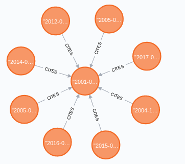
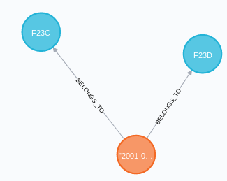
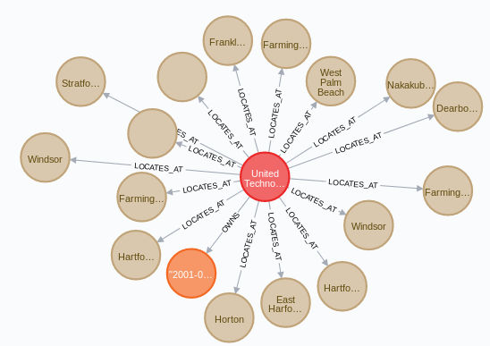

# neo4j_for_patentsview

Scripts handling PatentsView in Neo4j database. 

## Installation

```bash
pip install pandas numpy neo4j
```

## Usage

Put your `username` and `password` in a file, e.g., `credential.txt` like below
```bash
username
password
```

Download PatentsView dataset and decompress.

Run script with `python neo4j_load_patentsview.py credential.txt
[path_to_patentsview_data]`


## Database scheme

Nodes:
- `patent`, `assignee`, `inventor`, `location`
- `cpc_section`, `cpc_subsection`, `cpc_group`, `cpc_subgroup`
- `ipcr_section`, `ipcr_class`, `ipcr_subclass`, `ipcr_maingroup`, `ipcr_subgroup`
- `nber_category`, `nber_subcategory`
- `uspc_mainclass`, `uspc_subclass`, `location`

Edges:
- `CITES`
- `OWNS`
- `INVENTS`
- `BELONGS_TO`
- `LOCATES_AT`

## Examples

### Find all citations received by a certain patent

```sql
MATCH (p:patent)<-[:CITES]-(c:patent)
WHERE p.pid = '6178752'
RETURN p, c
```


### Find classfication information of a certain patent

```sql
MATCH (p:patent)-[:BELONGS_TO]->(c:cpc_group)
WHERE p.pid = '6178752'
RETURN p, c
```



### Find assignees of a certain patent

```sql
MATCH (p:patent)<-[:OWNS]-(a:assignee)
WHERE p.pid = '6178752'
RETURN p, a
```


### Find locations of the assignee of a certain patent

```sql
MATCH (p:patent)<-[:OWNS]-(a:assignee)-[:LOCATES_AT]->(l:location)
WHERE p.pid = '6178752'
RETURN p, a, l
```


